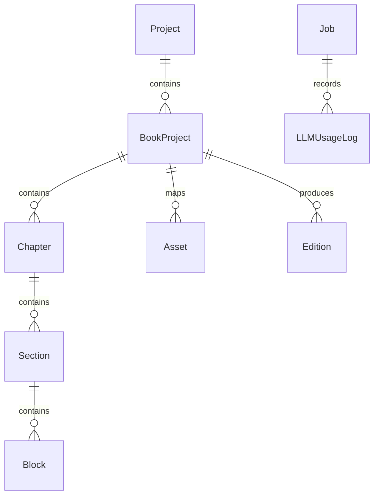

# ARCHITECTURE EVOLUTION PLAN: KDP Intelligence → Publishing Operating System

This document provides a comprehensive Architectural Impact Audit and strategic evolution plan for transforming **KDP Intelligence** from a keyword and niche research platform into a complete **KDP Publishing Operating System** (Research $\to$ Validation $\to$ Blueprint $\to$ Writing $\to$ Editing $\to$ Visuals $\to$ Formatting $\to$ QA $\to$ Translation $\to$ Editions $\to$ Export $\to$ Publishing).

---

## 1. Current Architecture
The application is built on:
- **Framework**: Next.js 15 (App Router, Server & Client Components) + React 19 + TypeScript.
- **Styling & UI**: Tailwind CSS + Lucide Icons + custom dark/light theme tokens (`#070b14` dark base, `#6366f1` brand indigo, emerald opportunity indicators).
- **Database & ORM**: Prisma ORM with SQLite (`dev.db`) in local development (easily configured for PostgreSQL via `DATABASE_URL`).
- **Data Engine**: Modular TypeScript services with clean separation of concerns:
  - `AmazonSuggestionProvider`: Live Amazon Completion API (`completion.amazon.com/api/2017/suggestions`) with alphabet (A-Z) and modifier expansion.
  - `KeywordVolumeEngine`: Algorithmic search volume estimator with confidence levels (`HIGH`, `MEDIUM`, `LOW`) and volume trend detection.
  - `ScoringEngine`: Transparent mathematical formulas for Demand Score (0–10), Competition Score (0–10), and Opportunity Score (0–10).
  - `NicheService`: Sub-niche finder and 16-point market dossier generator.
  - `SERPService`: Page 1 Amazon results analyzer with BSR-to-sales velocity and keyword match ratios.
  - `ReverseASINService`: ASIN reverse-engineering and keyword signal extractor.
  - `ClusteringEngine`: Semantic clustering grouping keywords into 5 thematic publishing categories.
  - `GapAnalysisEngine`: Cross-analysis of search demand vs Page 1 competitor coverage to identify underserved positioning angles.
  - `KDPBuilderService`: 4-angle title/subtitle generator, 7 Amazon backend keyword slots, and overlap/compliance scanner.
  - `DemoDataProvider`: Deterministic, high-fidelity research datasets for offline/fallback execution.
- **Exports**: Native Excel (`.xlsx`) via SheetJS and CSV generation with styled column widths and frozen headers.

---

## 2. Completed Functionality
The following systems are implemented, tested, and actively functioning on `http://localhost:3000`:
- **Phase 1: Core Research Intelligence**
  - Interactive Dashboard (`/`) with greeting, seed search, category selector, 6 metric cards, recent research sessions, and opportunity spotlight.
  - Keyword Explorer (`/keywords/explorer`) with live Amazon suggestion fetching, expansion toggle, filtering presets (🔥 High Demand, 🛡️ Low Competition, 💎 Hidden Gems, 🎯 Long Tail, 💰 Buyer Intent), column sorting, density toggles, bulk copy, and Excel/CSV export.
  - Saved Keywords (`/saved/keywords`) backed by Prisma ORM with tags, notes, and star status.
  - Research Projects (`/projects`) for organizing research campaigns.
  - Developer & Health Diagnostics (`/admin/health`) testing live Amazon API latency, database ping latency, and memory usage.
- **Phase 2: Niche & Competitor Intelligence**
  - Niche Finder (`/niches/finder`) uncovering sub-niches with newcomer ratios and median BSR.
  - 16-Point Niche Analyzer (`/niches/analyzer`) providing complete market dossiers, review/BSR/price/age distribution models, power word frequency, and risks.
  - First-Page Amazon SERP Analyzer (`/serp/analyzer`) breaking down Page 1 listings with BSR, estimated monthly royalties, and title/subtitle keyword match percentages.
  - Reverse ASIN Intelligence (`/competitors/reverse-asin`) extracting ranking keyword signals and title architecture.
  - Competitor Comparison Matrix (`/competitors/compare`) comparing up to 5 books side-by-side.
- **Phase 3: Advanced Optimization & Gap Analysis**
  - Semantic Keyword Clustering (`/keywords/clustering`) grouping keywords into thematic book concepts.
  - Opportunity Gap Analyzer (`/opportunities/gaps`) isolating demographic, dietary, practicality, and format gaps.
  - Title & Subtitle Builder (`/builder/title`) with character meters (200-char limit) and slot allocation.
  - 7 Backend Keywords Builder & Overlap Engine (`/builder/backend-keywords`) eliminating title redundancy and enforcing KDP compliance.

---

## 3. Current Phase
The project has successfully finished **Phases 1, 2, and 3**.
We are currently entering **Phase 4**:
- AI Research Assistant (Natural language research planning and execution)
- Automated Markdown Research Reports
- Multi-Keyword Trend Comparison
- Chrome Extension (Manifest V3) companion research overlay

---

## 4. Architecture Strengths
1. **Modular Service Layer**: Each engine (`ScoringEngine`, `SERPService`, `ClusteringEngine`, etc.) is decoupled from UI components and API route handlers.
2. **Data Provenance System**: Explicit tracking of data provenance (`REAL`, `ESTIMATED`, `USER_PROVIDED`, `DEMO`, `AI_DERIVED`) prevents confusing estimates with exact data.
3. **Normalized Relational Schema**: Prisma schema already models `Project`, `Keyword`, `KeywordMetric`, `Niche`, `Book`, `SavedKeyword`, `KeywordCluster`, `TitlePlan`, and `BackendKeywordPlan`.
4. **Transparent Scoring**: Formulas are completely visible with sub-weights rather than being a mysterious black box.
5. **Fast Server-Side Rendering**: Next.js 15 App Router provides sub-second page loads with zero hydration errors.

---

## 5. Architecture Risks
1. **Synchronous Execution Model**: Currently, API routes run synchronously. As we introduce long-running AI workflows (e.g. generating a 30-page research report, clustering 5,000 keywords, or generating a 35,000-word book manuscript), requests will exceed HTTP timeout thresholds without an asynchronous Job/Queue system.
2. **Monolithic Data Schema for Books**: The current `Book` model represents an Amazon competitor listing, but does not represent a user's *own* structured book project (FrontMatter, Chapters, Sections, Blocks).
3. **Provider Coupling**: LLM and AI models must be abstracted through an interface (`ILLMProvider`) supporting token budgeting, fallbacks, and cost tracking rather than hardcoding a single SDK.
4. **Local Database Concurrency**: SQLite is excellent for zero-setup local development, but concurrent multi-agent background writes will require WAL mode or PostgreSQL.

---

## 6. Required Foundational Changes (Implement Now)
To prepare for Phase 4 and subsequent phases without rewriting existing code:
1. **AI Provider Abstraction (`src/services/ai/LLMProvider.ts`)**:
   - Create unified interface supporting structured prompts, JSON schemas, streaming, and fallback execution.
2. **Asynchronous Job / Queue Abstraction (`src/services/jobs/JobQueue.ts`)**:
   - Model background jobs (`RESEARCH_JOB`, `REPORT_JOB`, `BOOK_JOB`) with states (`PENDING`, `RUNNING`, `COMPLETED`, `FAILED`), progress tracking (0–100%), and result payloads.
3. **Token & Cost Tracking Service (`src/services/ai/CostTracker.ts`)**:
   - Track prompt tokens, completion tokens, model name, and estimated USD cost per job to prevent runaway expenses.
4. **Prisma Schema Expansion**:
   - Add `Job`, `LLMUsageLog`, and `TrendComparison` models.

---

## 7. Changes That Can Wait (Do NOT Build Prematurely)
- Do **NOT** build the full drag-and-drop Block Document Editor until Phase 5.
- Do **NOT** implement EPUB / print-ready PDF binary generators until Phase 8.
- Do **NOT** implement multi-user team workspaces or enterprise RBAC until Phase 10.
- Do **NOT** build complex fiction Story Bibles or continuity graphs until Phase 6.

---

## 8. Database Evolution
The relational database will evolve incrementally across phases:

- **Phase 4 Additions**: `Job`, `LLMUsageLog`, `TrendSnapshot`.
- **Phase 5 Additions**: `BookProject`, `Blueprint`, `Chapter`, `Section`, `Block`, `DocumentVersion`.
- **Phase 6 Additions**: `StoryBible`, `CharacterProfile`, `ClaimCitation`.
- **Phase 7 Additions**: `Asset`, `ImageSpecification`, `DiagramData`.
- **Phase 8 Additions**: `BookDesignPreset`, `FormattingProfile`.

---

## 9. API Evolution & Service Boundaries
The API is organized into domain-driven namespaces:
- `/api/keywords/*`: Keyword discovery, expansion, volume estimation, and clustering.
- `/api/niches/*`: Niche discovery and 16-point dossiers.
- `/api/serp/*`: Page 1 Amazon scraping/provider analysis.
- `/api/competitors/*`: Reverse ASIN lookup and comparison matrices.
- `/api/builder/*`: Titles, subtitles, and 7 backend keyword slots.
- `/api/ai/*` (New in Phase 4): Natural language research assistant and automated reports.
- `/api/trends/*` (New in Phase 4): Trajectory curves and historical comparisons.
- `/api/jobs/*` (New in Phase 4): Background job polling and status tracking.

---

## 10. AI Agent Architecture
Rather than a single monolithic agent, the platform uses specialized agent contracts coordinated by an `Orchestrator`:
- `ResearchAgent`: Translates natural-language requests into structured research queries, fetches data, and synthesizes competitive dossiers.
- `ReportAgent`: Generates executive summaries, gap analyses, and compliance checklists.
- `Future Agents (Phases 5-10)`: `BookArchitect`, `NonfictionWriter`, `CookbookAgent`, `ContinuityAgent`, `FormatterAgent`, `QAAgent`.

---

## 11. Structured Document Architecture (The Core Philosophy)
The system strictly avoids the "AI writes text $\to$ dump into Word" trap. Instead:
$$\text{Research} \longrightarrow \text{Blueprint} \longrightarrow \text{Structured Blocks} \longrightarrow \text{Design System} \longrightarrow \text{Format Renderer}$$
Every book is modeled as a tree of typed blocks:
- `ParagraphBlock`, `HeadingBlock`, `CalloutBlock`, `QuoteBlock`
- `RecipeBlock` (structured: yield, prep/cook time, ingredients array, instructions array, macro nutrition)
- `TableBlock` (structured rows, columns, headers)
- `ImageBlock` (slot ID, aspect ratio, resolution, bleed, prompt, caption)
- `DiagramBlock` (JSON-defined flowchart, timeline, or comparison chart rendered programmatically)

---

## 12. Asset Architecture
Every visual asset is a first-class entity linked to specific document locations:
- `Asset`: `id`, `bookId`, `chapterId`, `blockId`, `type` (`IMAGE`, `DIAGRAM`, `TABLE`, `COVER`), `dimensions`, `aspectRatio`, `resolutionDPI`, `approvalStatus` (`DRAFT`, `APPROVED`, `REJECTED`).
- Prevents orphaned images and enables automated multi-edition localization.

---

## 13. Job / Queue Architecture
Asynchronous task processing pattern:
1. Client issues `POST /api/ai/research` $\to$ Returns immediately with `jobId` and `202 Accepted`.
2. Background worker processes the job, updating `progress` (0–100%) and stage (`COLLECTING_KEYWORDS`, `ANALYZING_SERP`, `SYNTHESIZING_REPORT`).
3. Client polls or receives reactive SSE/WebSocket updates.
4. Finished job stores full result in database.

---

## 14. Export Architecture
Renderers are output adapters that read the structured document tree:
- `DOCXRenderer`: Generates styled Word manuscripts with native styles and tables.
- `PDFRenderer`: Uses headless Chromium or Typst/Weasyprint to produce print-ready PDFs with gutters, bleeds, and running headers.
- `EPUBRenderer`: Generates validated reflowable EPUB 3 files with embedded fonts and TOC navigation.

---

## 15. Chrome Extension Architecture (Manifest V3)
- Located in `extension/`.
- Content Script injects floating dock `#kdp-intelligence-dock` into Amazon SERP (`amazon.*/s?k=*`) and Product Pages (`amazon.*/dp/*`).
- Service Worker handles messaging and queries local web app API (`http://localhost:3000/api/*`).
- Instant actions: Capture ASIN, extract suggestions, calculate quick Opportunity Score, and send to web app project.

---

## 16. Multi-Marketplace Architecture
- Supported: `amazon.com` (US), `amazon.co.uk` (UK), `amazon.de` (DE), `amazon.ca` (CA), `amazon.com.au` (AU), `amazon.es` (ES), `amazon.fr` (FR), `amazon.it` (IT), `amazon.co.jp` (JP).
- All models and API requests include `marketplace` to ensure correct domain routing, currency formatting, and language handling.

---

## 17. Multi-Language Architecture
- UI localization prepared via i18n keys.
- Document model supports explicit `language` and `textDirection` (`LTR` / `RTL`).
- Edition mapping (`originalBookId` $\to$ `translatedBookId`) preserves block structure while translating textual content.

---

## 18. Security Architecture
- Provider API keys (Google Gemini, OpenAI, Rainforest, etc.) stored exclusively in server-side `.env` files.
- Input sanitization on all search queries and book content.
- KDP compliance validator flags intellectual property violations and deceptive claims.

---

## 19. Scalability
- Virtualized tables (`TanStack Virtual`) for datasets with 10,000+ keywords.
- Indexed database columns (`normalizedTerm`, `asin`, `marketplace`, `projectId`).
- Caching layer for Amazon autocomplete queries to minimize external HTTP overhead.

---

## 20. Migration Plan
1. **Foundational Step (Now)**:
   - Add Job/Queue and LLM provider abstractions.
   - Update Prisma schema with `Job`, `LLMUsageLog`, and `TrendSnapshot` models.
   - Verify build and tests pass without breaking any existing Phase 1, 2, or 3 features.
2. **Phase 4 Execution (Immediate)**:
   - Build AI Research Assistant (`/assistant/research` & `/api/ai/research`).
   - Build Automated Markdown Research Reports (`/reports` & `/api/ai/report`).
   - Build Multi-Keyword Trend Comparison (`/trends/compare` & `/api/trends/compare`).
   - Build Chrome Extension (Manifest V3 in `extension/`).
3. **Subsequent Roadmap**:
   - Phase 5: Book Studio & Structured Document Model.
   - Phase 6: AI Writing Engine & Story/Research Bibles.
   - Phase 7: Visual Engine & Diagram Mapping.
   - Phase 8: Smart Formatter (PDF, EPUB, DOCX).
   - Phase 9: Book QA & KDP Compliance.
   - Phase 10: Publishing Factory & Multi-Edition Automation.
