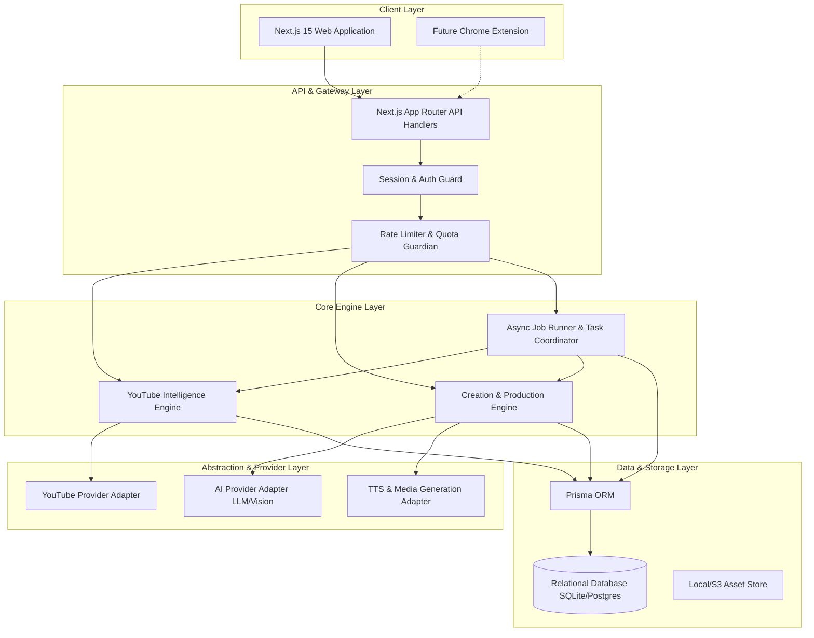

# VYRAL: System & Product Architecture Specification

**Product Name:** VYRAL  
**Product Type:** AI-Powered YouTube Intelligence, Research, Creation & Growth Platform  
**Architecture Document Version:** 1.0.0  
**Status:** Canonical Reference

---

## 1. Executive Summary & Product Vision

VYRAL is a professional YouTube Operating System designed to replace fragmented creator workflows. It bridges the gap between intelligence and execution through an unbroken operational loop:

$$\text{DISCOVER} \longrightarrow \text{ANALYZE} \longrightarrow \text{PLAN} \longrightarrow \text{CREATE} \longrightarrow \text{OPTIMIZE} \longrightarrow \text{PUBLISH} \longrightarrow \text{MEASURE} \longrightarrow \text{LEARN} \longrightarrow \text{DISCOVER AGAIN}$$

VYRAL treats YouTube not as a series of isolated videos, but as an empirical ecosystem of audience demand signals, packaging experiments, format mechanics, and content DNA.

---

## 2. Core Architectural Principles

1. **Intelligence Informs Creation**: Scripts, titles, thumbnails, and structures are never generated in a vacuum; they are grounded in observed audience interest, outlier patterns, and verified content gaps.
2. **Strict Data Provenance**: Every metric displayed in the system must know and declare its provenance:
   - `YOUTUBE_API`: Official public data from the YouTube Data API v3.
   - `USER_CONNECTED`: Authenticated creator metrics via YouTube Analytics API.
   - `OBSERVED`: System-scraped or public channel observations.
   - `HISTORICAL`: Time-series metric tracked internally over time.
   - `ESTIMATED`: Computed heuristic or statistical approximation (always labeled).
   - `AI_DERIVED`: Synthesized via LLM or Computer Vision inference.
   - `INTERNAL_METRIC`: Proprietary benchmark (e.g., Outlier Multiplier, Velocity Index).
   - *Never fabricate data or present estimates as official YouTube metrics.*
3. **No Monetization / No Credit Gating in Current Stage**: All platform capabilities are fully unlocked for any authenticated user. The architecture remains modular so billing can be cleanly introduced later without rewrites.
4. **Provider Abstraction**: All external services (YouTube data, LLMs, Image generation, TTS, Video rendering, Transcription) sit behind strict interface boundaries. The core engine never couples directly to a third-party vendor.
5. **Asynchronous Non-Blocking Processing**: Heavy tasks (channel audits, competitor scans, transcript NLP, video rendering) execute via background jobs with persistent state tracking (`QUEUED`, `RUNNING`, `COMPLETED`, `FAILED`).

---

## 3. System Component Architecture

---

## 4. Subsystem Breakdown

### 4.1. Navigation & Functional Domains

1. **HOME**:
   - **Dashboard**: Command center displaying active channel overview, high-probability opportunities, baseline performance outliers, and strategic AI action cards.
2. **DISCOVER**:
   - **Idea Finder**: Signal-backed idea generator based on audience gaps and velocity.
   - **Niche Finder**: Deep category and market explorer with outlier frequency analysis.
   - **Topic Explorer**: Semantic topic mapping and rising search queries.
   - **Trend Radar**: Emerging, rising, hot, and cooling topic detection.
   - **Outliers**: Dedicated scanner for videos performing 2x to 10x+ above channel baselines.
3. **INTELLIGENCE**:
   - **Channel Analyzer**: Deep autopsy of any channel (DNA, upload frequency, formats, averages).
   - **Video Analyzer**: Video autopsy, hook mechanics, pacing, and audience comment sentiment.
   - **Channel DNA**: Structural blueprinting (Positioning, Topic Pillars, Title DNA, Visual DNA).
   - **Competitor Radar**: Automated surveillance of competitor moves, format shifts, and outliers.
   - **Market Explorer**: Broad landscape mapping across related creator ecosystems.
4. **CREATE**:
   - **Idea Studio**: Workspace for developing validated concepts into projects.
   - **Script Studio**: Multi-format writing suite (Shorts, Documentaries, Listicles, Explainers) with Content Blueprinting.
   - **Voice Studio**: TTS generation with voice, tone, and pacing controls.
   - **Visual Studio**: Scene-by-scene storyboard director and image generator.
   - **Thumbnail Studio**: Multi-concept visual generator and composition analyzer.
   - **Video Builder**: Automated multi-track production pipeline.
   - **Video Editor**: Timeline editor supporting 16:9, 9:16, and 1:1 aspect ratios.
5. **OPTIMIZE**:
   - **Title Lab**: 11-mode title generator and psychological scoring engine.
   - **Thumbnail Lab**: Visual contrast, mobile readability, and clutter analyzer.
   - **Retention Architect**: Script beat detector, open-loop tracker, and curiosity gap optimizer.
   - **SEO Assistant**: Keyword placement, tag mapping, and description structuring.
   - **Experiments**: Systematic tracking of packaging tests (titles/thumbnails) and recorded outcomes.
6. **GROW**:
   - **Analytics**: Historical growth and cohort performance.
   - **Channel Health**: Cadence tracking, viewer fatigue detection, and benchmark monitoring.
   - **Alerts**: Real-time notifications for competitor spikes and emerging trends.
   - **Reports**: Executive summaries and channel audit exports.
7. **LIBRARY**:
   - **Projects**: Unified workspaces encompassing research, scripts, assets, and packaging.
   - **Swipe File**: Categorized library of saved videos, channels, titles, hooks, and formats.
   - **Brand Profiles**: Channel-specific style guides, tone definitions, and visual presets.
8. **AI**:
   - **VYRAL Intelligence**: Conversational co-pilot capable of orchestrating intelligence tools, finding opportunities, and drafting scripts.

---

## 5. Security & Authentication Architecture

1. **Authentication**:
   - Built-in session authentication with salted password hashing (PBKDF2/Argon2).
   - HTTP-only, secure, SameSite cookies storing encrypted session tokens.
   - Password reset workflow with time-limited crypto tokens.
2. **Access Control**:
   - Middleware-enforced auth check on all `/api/*` and protected dashboard routes.
   - Role-ready schema (supporting `CREATOR`, `ADMIN` roles).
   - Multi-channel tenant isolation: All queries filter by `userId` and active `channelId`.
3. **Secret Protection**:
   - YouTube API keys and AI provider keys are exclusively accessed server-side via environment variables.
   - No sensitive keys or tokens are ever exposed to client bundles.

---

## 6. Chrome Extension Architecture (Future Phase Preparation)

The API is architected with a dedicated REST endpoint namespace (`/api/v1/extension/*`) that authenticates via standard session tokens or personal API tokens.

**Capabilities Prepared in API**:
- `POST /api/v1/extension/analyze-video`: Ingests active YouTube video URL, runs autopsy, returns outlier score.
- `POST /api/v1/extension/analyze-channel`: Ingests active channel handle, returns DNA and top outliers.
- `POST /api/v1/extension/swipe`: Saves currently viewed video, title, or thumbnail into user's Swipe File.

---

## 7. Performance & Scalability Strategy

1. **Database Indexing**: Explicit composite indexes on `[channelId, publishedAt]`, `[userId, status]`, and `[outlierMultiplier]`.
2. **Pagination & Streaming**: Virtualized tables and cursor-based pagination for large video and channel lists.
3. **Asynchronous Execution**: External API fetching and AI generation tasks are queued in `ResearchJob` table, preventing HTTP timeout bottlenecks.
4. **Caching Layer**: In-memory and database caching of normalized YouTube API responses with configurable TTLs to conserve API quotas.
