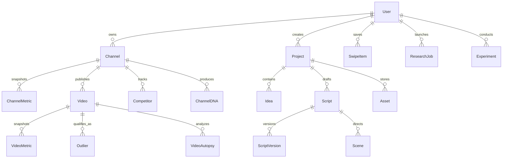

# VYRAL: Relational Data Model & Schema Specification

**Product:** VYRAL  
**Version:** 1.0.0  
**Database Technology:** Prisma ORM with SQLite (Development) / PostgreSQL (Production)

---

## 1. Schema Design Principles

1. **Strict Relational Normalization**: No monolithic JSON documents for primary business entities. Clean foreign keys, cascade rules, and relational integrity.
2. **Explicit Data Provenance**: Core metric models record their source (`YOUTUBE_API`, `USER_CONNECTED`, `OBSERVED`, `HISTORICAL`, `ESTIMATED`, `AI_DERIVED`, `INTERNAL_METRIC`), timestamp, and confidence.
3. **Multi-Channel & Multi-Tenant**: Content and research can be segmented by user and assigned to specific managed channels or projects.
4. **Historical Time-Series Tracking**: Channel and video performance metrics are captured as snapshot records to enable trend, velocity, and outlier calculations over time.

---

## 2. Entity Relationship Diagram

---

## 3. Detailed Entity Definitions

### 3.1. User & Authentication
- `User`: Primary account record (`id`, `email`, `passwordHash`, `salt`, `name`, `avatarUrl`, `role`, `createdAt`, `updatedAt`).
- `Session`: Active login session (`id`, `userId`, `token`, `expiresAt`, `createdAt`).
- `PasswordResetToken`: Secure time-bounded reset tokens (`id`, `userId`, `token`, `expiresAt`).

### 3.2. Channels & Creator Profiles
- `Channel`: Managed or tracked YouTube channel (`id`, `userId`, `youtubeChannelId`, `handle`, `title`, `description`, `thumbnailUrl`, `customUrl`, `country`, `publishedAt`, `isOwned`).
- `ChannelMetric`: Snapshot of subscriber counts, total views, video count, baseline average views, Shorts vs Long-form ratio, upload frequency (`id`, `channelId`, `subscriberCount`, `viewCount`, `videoCount`, `avgViews30d`, `provenance`, `recordedAt`).
- `ChannelDNA`: Algorithmic blueprint (`id`, `channelId`, `positioning`, `topicPillars`, `titleDNA`, `thumbnailDNA`, `hookDNA`, `visualDNA`, `storytellingDNA`).

### 3.3. Videos & Performance
- `Video`: Tracked YouTube video (`id`, `channelId`, `youtubeVideoId`, `title`, `description`, `thumbnailUrl`, `durationSeconds`, `isShort`, `publishedAt`).
- `VideoMetric`: Performance snapshot (`id`, `videoId`, `views`, `likes`, `comments`, `viewVelocity`, `provenance`, `recordedAt`).
- `VideoAutopsy`: Deep structural analysis (`id`, `videoId`, `hookText`, `hookType`, `contentStructure`, `whyItStandsOut`, `whatIsReplicable`, `whatNotToCopy`, `retentionNotes`).
- `Outlier`: Benchmark-exceeding videos (`id`, `videoId`, `channelId`, `multiplier`, `baselineViews`, `actualViews`, `classificationReason`, `detectionDate`).

### 3.4. Discovery, Niches & Trends
- `Niche`: Creator niche taxonomy (`id`, `name`, `category`, `outlierRate`, `competitionIndex`, `description`).
- `Topic`: Specific subject or angle (`id`, `nicheId`, `title`, `searchVolumeSignal`, `trendStatus` [EARLY, RISING, HOT, COOLING]).
- `Keyword`: High-intent search terms (`id`, `term`, `relevanceScore`, `searchVolumeEstimate`, `provenance`).

### 3.5. Competitor Intelligence
- `Competitor`: Monitored rival channel (`id`, `managedChannelId`, `competitorChannelId`, `notes`, `isActive`).
- `CompetitorAlert`: Activity alerts (`id`, `competitorId`, `type` [NEW_UPLOAD, OUTLIER_SPIKE, TOPIC_SHIFT, FREQUENCY_CHANGE], `message`, `isRead`, `createdAt`).

### 3.6. Creation Studio & Projects
- `Project`: Workspaces for end-to-end video production (`id`, `userId`, `channelId`, `title`, `status`, `createdAt`, `updatedAt`).
- `Idea`: Generated and saved video concepts (`id`, `projectId`, `titleConcept`, `topic`, `format`, `hook`, `whyNow`, `competitiveGap`, `thumbnailPrompt`, `status`).
- `Script`: Content script document (`id`, `projectId`, `title`, `format` [SHORTS, DOCUMENTARY, STORYTELLING, EXPLAINER], `currentVersionId`, `blueprint`).
- `ScriptVersion`: Immutable historical revisions (`id`, `scriptId`, `versionNumber`, `content`, `retentionScore`, `createdAt`).
- `Scene`: Storyboard and visual directions (`id`, `scriptId`, `sceneIndex`, `narration`, `visualDescription`, `imagePrompt`, `cameraMovement`, `transition`, `durationSeconds`).
- `Asset`: Project files (`id`, `projectId`, `type` [IMAGE, AUDIO, VIDEO, THUMBNAIL], `fileUrl`, `metadata`).

### 3.7. Optimization & Labs
- `TitleConcept`: Multi-mode title options (`id`, `projectId`, `title`, `mode` [CURIOSITY, DOCUMENTARY, SHORTS, etc.], `clarityScore`, `curiosityScore`, `mobileFit`).
- `ThumbnailConcept`: Visual concepts and analysis (`id`, `projectId`, `conceptTitle`, `composition`, `focalSubject`, `prompt`, `clutterScore`, `contrastScore`).
- `Experiment`: Packaging A/B and outcome tracking (`id`, `channelId`, `videoId`, `testType` [TITLE, THUMBNAIL, HOOK], `variantA`, `variantB`, `outcomeNotes`, `status`).

### 3.8. Library, Swipe File & Operations
- `SwipeItem`: Creator swipe library (`id`, `userId`, `type` [VIDEO, CHANNEL, TITLE, THUMBNAIL, HOOK], `title`, `sourceUrl`, `thumbnailUrl`, `notes`, `tags`).
- `ResearchJob`: Background async task runner (`id`, `userId`, `type` [CHANNEL_SCAN, VIDEO_AUTOPSY, OUTLIER_SCAN, AI_GENERATION], `status` [QUEUED, RUNNING, COMPLETED, FAILED], `progress`, `resultPayload`, `errorMessage`, `createdAt`, `updatedAt`).
- `AIJobRun`: Log of model executions (`id`, `userId`, `provider`, `model`, `promptTokens`, `completionTokens`, `durationMs`, `status`).
