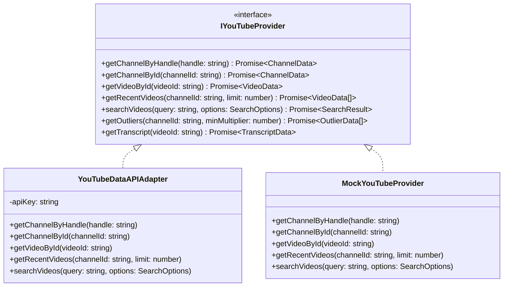
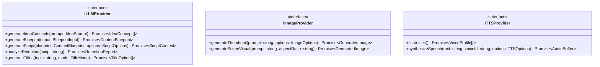

# VYRAL: Provider Abstraction Architecture

**Product:** VYRAL  
**Version:** 1.0.0  
**Specification Type:** Interface Contracts & Adapter Design

---

## 1. Architectural Motivation

To ensure VYRAL is robust, future-proof, and decoupled from any single external API or AI vendor:
1. **No direct vendor calls in UI components or route handlers**: All external integrations go through strongly-typed provider interfaces.
2. **Pluggable & Mockable**: Every provider interface has at least two implementations:
   - A **Production Adapter** (connecting to the real API, e.g., YouTube Data API v3, OpenAI, Anthropic, ElevenLabs).
   - A **Demo / Mock Adapter** (returning deterministic, realistically shaped data labeled explicitly with `DEMO_DATA` provenance, enabling offline development, rapid testing, and zero quota burn).
3. **Data Normalization & Provenance Tagging**: Raw third-party payloads are never saved directly to the database. The provider layer normalizes responses into VYRAL's internal domain models and tags every metric with its exact provenance.

---

## 2. YouTube Intelligence Providers



### 2.1. Core Interfaces

```typescript
export interface IChannelProvider {
  getChannelByHandle(handle: string): Promise<NormalizedChannel>;
  getChannelById(channelId: string): Promise<NormalizedChannel>;
  getChannelVideos(channelId: string, pageToken?: string, limit?: number): Promise<PaginatedVideos>;
  computeChannelBaseline(channelId: string): Promise<ChannelBaseline>;
}

export interface IVideoProvider {
  getVideoDetails(videoId: string): Promise<NormalizedVideo>;
  getVideoMetrics(videoId: string): Promise<NormalizedVideoMetrics>;
  getVideoComments(videoId: string, limit?: number): Promise<NormalizedComment[]>;
}

export interface ISearchProvider {
  searchVideos(query: string, filters: SearchFilters): Promise<SearchResults<NormalizedVideo>>;
  searchChannels(query: string, filters: SearchFilters): Promise<SearchResults<NormalizedChannel>>;
  searchTopics(topic: string): Promise<TopicSignal[]>;
}

export interface ITranscriptProvider {
  fetchTranscript(videoId: string): Promise<TranscriptSegment[]>;
  extractHooks(transcript: TranscriptSegment[]): Promise<HookAnalysis>;
  extractContentStructure(transcript: TranscriptSegment[]): Promise<ContentBeat[]>;
}
```

---

## 3. AI & Generative Providers



### 3.1. Core AI Interfaces

```typescript
export interface ILLMProvider {
  generateText(prompt: string, systemPrompt?: string): Promise<string>;
  generateStructured<T>(prompt: string, schema: any): Promise<T>;
  generateIdeas(niche: string, goal: string): Promise<IdeaPayload[]>;
  generateTitles(topic: string, mode: string, count: number): Promise<TitlePayload[]>;
}

export interface IImageProvider {
  generateImage(prompt: string, options: { width: number; height: number; style?: string }): Promise<{ url: string }>;
}

export interface ITTSProvider {
  generateAudio(text: string, voiceId: string): Promise<{ audioUrl: string; durationSeconds: number }>;
}
```

---

## 4. Provider Factory & Configuration

Providers are resolved dynamically via `src/lib/providers/factory.ts`:

```typescript
export class ProviderFactory {
  static getYouTubeProvider(): IYouTubeProvider {
    const useMock = process.env.USE_MOCK_YOUTUBE === "true" || !process.env.YOUTUBE_API_KEY;
    if (useMock) {
      return new MockYouTubeProvider();
    }
    return new YouTubeDataAPIAdapter(process.env.YOUTUBE_API_KEY!);
  }

  static getLLMProvider(): ILLMProvider {
    // Dynamically instantiates Anthropic, OpenAI, or Gemini adapter based on configured environment variables
  }
}
```
