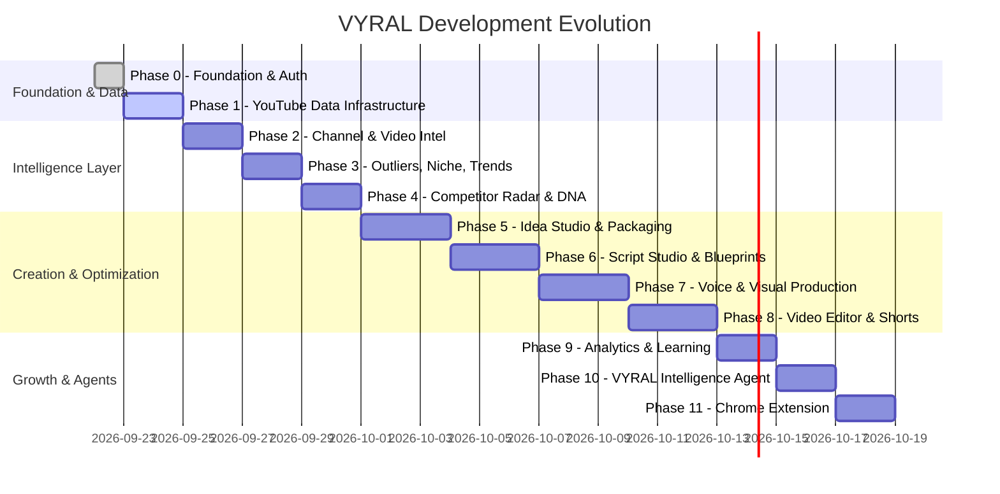

# VYRAL: Phased Product Roadmap

**Product:** VYRAL (YouTube Intelligence, Research, Creation & Growth Platform)  
**Version:** 1.0.0  
**Status:** Living Execution Roadmap

---

## Roadmap Overview

VYRAL is built in 12 distinct phases, establishing rock-solid foundations before advancing into heavy AI creation and video production.

---

## Phase Breakdown

### Phase 0: Foundation & Authentication
- **Objective:** Establish the development environment, design system, relational database schema, session authentication, and core application shell.
- **Deliverables:**
  - Complete architectural documentation (`VYRAL_ARCHITECTURE.md`, `VYRAL_ROADMAP.md`, `VYRAL_DATA_MODEL.md`, `VYRAL_PROVIDER_ARCHITECTURE.md`).
  - Prisma relational schema with models for Users, Channels, Videos, Outliers, Niches, Trends, Projects, Scripts, and Research Jobs.
  - Secure authentication (Sign up, Log in, Log out, Password Reset, Profile Management).
  - Modern dark-first SaaS UI shell with responsive collapsible navigation and multi-channel command bar.
  - Global Dashboard with Channel Overview, Opportunities Feed, Performance Tracker, and Strategic AI Recommendations.

### Phase 1: YouTube Data Infrastructure & Research Engine
- **Objective:** Build the provider abstraction layer, schema normalizer, data provenance system, and initial research services.
- **Deliverables:**
  - YouTube Data Provider abstraction (`IChannelProvider`, `IVideoProvider`, `ISearchProvider`, `ITranscriptProvider`).
  - Production adapter for YouTube Data API v3 and Mock/Demo provider with explicit `DEMO_DATA` labeling.
  - Data Provenance tagging engine (`YOUTUBE_API`, `OBSERVED`, `HISTORICAL`, `ESTIMATED`, `AI_DERIVED`, `INTERNAL_METRIC`).
  - Asynchronous Research Job runner with database persistence.
  - Channel Lookup and Video Inspector services.

### Phase 2: Channel & Video Intelligence
- **Objective:** In-depth autopsy engines for channels and individual videos.
- **Deliverables:**
  - **Channel Analyzer:** Upload frequency, video length distributions, format ratios (Shorts vs Long-form), average view baselines, content categories.
  - **Video Analyzer (Video Autopsy):** Performance vs baseline, engagement velocity, hook analysis, content structure breakdown, comment sentiment and audience questions.
  - "Why this video stands out" & "What is replicable vs What should not be copied" synthesis engine.

### Phase 3: Outliers, Niche & Trends
- **Objective:** Uncover asymmetric content opportunities across niches and trending topics.
- **Deliverables:**
  - **Outlier Engine:** Algorithmic calculation of video performance relative to channel average (2x to 10x+ multipliers). Channel, niche, and emerging outlier scanners.
  - **Niche Lab:** Niche size, competition index, outlier rate, emerging channels, and content gaps.
  - **Trend Radar:** Early, Rising, Hot, and Cooling topic signals with niche and format filters.

### Phase 4: Competitor Intelligence & Channel DNA
- **Objective:** Surveillance of competitor moves and deep structural extraction of content patterns.
- **Deliverables:**
  - **Competitor Radar:** Tracking uploads, view velocity spikes, format shifts, and topic migrations with real-time alerts.
  - **Channel DNA:** Positioning, Topic Pillars, Title DNA, Visual DNA, Hook DNA, and Storytelling DNA.
  - "Create Original Content from this DNA" pipeline without copying intellectual property.

### Phase 5: Idea Studio & Packaging Labs (Title & Thumbnail)
- **Objective:** Bridge intelligence into actionable concepts with psychological packaging optimization.
- **Deliverables:**
  - **AI Idea Studio:** Signal-backed concept generation with hooks, formats, target audience, and competitive context.
  - **Title Lab:** 11-mode title generator (Curiosity, Documentary, Storytelling, Shorts, etc.) with clarity, stakes, and mobile readability scores.
  - **Thumbnail Lab & Studio:** Visual hierarchy, contrast, clutter analyzer, and multi-concept generation prompts.

### Phase 6: Script Studio & Retention Architect
- **Objective:** Professional long-form and Shorts writing suite.
- **Deliverables:**
  - **Content Blueprinting:** Target audience, core promise, hook, major beats, open loops, and payoff.
  - **Script Studio:** Multi-format generation (Documentary, Storytelling, Faceless Narration, Talking Head) with granular editing (tighten pacing, strengthen hook, expand beat).
  - **Retention Architect:** Structural analysis of curiosity gaps, pattern interrupts, and pacing flow.

### Phase 7: Voice, Visual & Production Engine
- **Objective:** Transform scripts into structured audiovisual assets.
- **Deliverables:**
  - **Voice Studio:** TTS abstraction with voice selection, pacing, and emotional tone.
  - **Visual Director:** Scene-by-scene storyboard generator with camera movement, shot directions, and image prompts.
  - **Sound Design:** Music mood mapping and sound effects (SFX) timeline cues.

### Phase 8: Video Builder, Editor & Shorts Repurposing
- **Objective:** Multi-track timeline assembly and vertical video repurposing.
- **Deliverables:**
  - **Video Builder:** Automated pipeline stitching narration, visuals, background audio, and captions.
  - **Video Editor:** Browser-based multi-track timeline supporting 16:9, 9:16, and 1:1 aspect ratios.
  - **Shorts Repurposing Engine:** Automatic identification of high-retention moments in long videos with 9:16 reframing and animated captions.

### Phase 9: Analytics & Channel Learning
- **Objective:** Connect real creator channel data to complete the feedback loop.
- **Deliverables:**
  - Multi-channel analytics dashboard with historical cohort tracking.
  - **Channel Learning Engine:** Identifies what works specifically for the creator's channel and recommends next tests.
  - **Experiment Manager:** Title, thumbnail, and hook testing logs with outcome tracking.

### Phase 10: VYRAL Intelligence Agent
- **Objective:** Central conversational AI co-pilot that orchestrates the entire platform.
- **Deliverables:**
  - Natural-language queries ("Find emerging true crime channels under 100K subs", "Analyze these 5 competitors", "Draft a 12-minute documentary script from outlier #3").
  - Autonomous tool orchestration with clear data citations and provenance.

### Phase 11: Chrome Extension
- **Objective:** In-situ YouTube browsing intelligence overlay.
- **Deliverables:**
  - Chrome Extension communicating with VYRAL REST API.
  - Quick video autopsy, channel outlier check, and one-click "Add to Swipe File" from any YouTube page.
